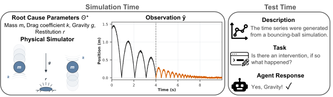

# TraceBench



TraceBench is a controlled benchmark for evaluating LLM agents on time-series root-cause attribution.

This repository contains the evaluation runtime, task adapter, scoring code, aggregation utilities, schemas, and tests needed to rerun the paper evaluation.

Data and released results are hosted in the [TraceBench Hugging Face dataset](https://huggingface.co/datasets/eth-siplab/tracebench), while the [project website](https://tracebench.github.io/) provides a browsable overview.

## Repository map

- `shared/` contains schemas, validators, prompt rendering, and task-materialization utilities.
- `workflows/rollout/` runs questions and evaluates completed artifacts.
- `workflows/metrics/` and `workflows/trajectory/` compute scores and trajectory measurements.
- `terminal-bench/` contains the pinned Terminal-Bench runtime and TraceBench adapter used by the paper.
- `scripts/` downloads the pinned public release and reproduces released aggregates.

## Requirements

- Python 3.12.
- [`uv`](https://docs.astral.sh/uv/).
- Docker for task execution.
- An API key for the selected agent platform when running a real model evaluation.

Install the locked environment:

```bash
git clone https://github.com/TommasoBendinelli/TraceBench.git
cd TraceBench
uv sync --python 3.12 --frozen
```

## Configure API-key authentication
Copy the example file and populate the key for the platform you plan to run:

```bash
cp .env.example .env
```


| Agent platform | Environment variable |
| --- | --- |
| Codex | `OPENAI_API_KEY` |
| Gemini CLI | `GEMINI_API_KEY` |
| Claude Code | `ANTHROPIC_API_KEY` |
| OpenCode through OpenRouter | `OPENROUTER_API_KEY` |

Only the key for the selected agent profile is required.
An exported environment variable takes precedence over the same entry in `.env`.

## Download the pinned release

The following command downloads the question bundle plus matching CSV and Parquet result tables from the immutable Hugging Face revision recorded in `reproduction/manifest.json`:

```bash
uv run python scripts/download_release.py
```

The layout is:

```text
data/
├── questions/
│   ├── BallDrop/
│   ├── BounceBall/
│   └── MassSlide/
├── release_manifest.json
├── results.csv
└── results.parquet
```


## Reproduce released results

Recompute the released paper-run aggregates and accuracy figure:

```bash
uv run python scripts/reproduce_results.py \
  --results-csv data/results.csv \
  --output-dir artifacts/reproduced
```

The command verifies the pinned `results.csv` checksum and writes condition-level and agent-level CSV summaries, a JSON provenance record, and an accuracy plot.

## Materialize and select a paper task

Materialize one released task without contacting a model provider:

```bash
uv run python terminal-bench/adapters/tsENV/run_adapter.py \
  data/questions/BallDrop \
  --output-dir /tmp/tracebench-task \
  --overwrite \
  --only-question-id frost_01234-anchor_0
```

Create a one-question execution plan without launching the agent:

```bash
uv run python workflows/rollout/question_run_orchestrator.py \
  --tasks-dir data/questions \
  --model BallDrop \
  --agent-id gpt_5_5_codex_high \
  --question-slug frost_01234-anchor_0 \
  --dry-run \
  --name smoke
```

Remove `--dry-run` to launch the configured evaluation after Docker is available and the selected platform's API key is configured.

A real run can consume paid provider capacity and may produce different text, cost, token, or accuracy outcomes as hosted models and agent services change.


### External prerequisites

Docker is required for real Terminal-Bench execution.

Each provider has its own API availability and billing requirements.

Provider-backed reruns may incur charges and should begin with a one-question smoke run.
